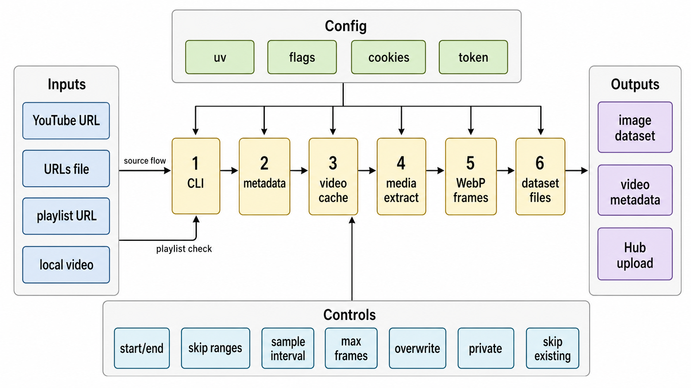

# youtube2datasets

`youtube2datasets` is a Python CLI for turning YouTube videos, playlists, or local video files into Hugging Face-ready image datasets.

It downloads or reads source video, samples frames at fixed intervals, stores lossless WebP images, writes `imagefolder` metadata, and can push the prepared dataset to the Hugging Face Hub.

## Install

```bash
git clone https://github.com/tsilva/youtube2datasets.git
cd youtube2datasets
uv sync --extra dev
uv run youtube2datasets --help
```

Use `uv run youtube2datasets ...` from the repo root.

## Commands

```bash
uv run youtube2datasets --help            # show CLI help
uv run youtube2datasets prepare ...       # build one imagefolder dataset
uv run youtube2datasets prepare-playlist  # build one dataset per playlist video
uv run youtube2datasets upload ...        # push a prepared dataset to the Hub
uv run pytest                             # run tests
```

Prepare a dataset from a YouTube URL:

```bash
uv run youtube2datasets prepare \
  --url https://www.youtube.com/watch?v=te8T6FzK_2I \
  --output-dir ./out/zx-spectrum-dataset \
  --download-dir ./out/downloads \
  --sample-every 10 \
  --start 00:01:00 \
  --skip-range 00:00:00-00:00:45 \
  --target-width 512 \
  --target-height 384 \
  --tag platform=zx-spectrum \
  --tag source=worldoflongplays
```

Upload a prepared dataset:

```bash
uv run youtube2datasets upload \
  --dataset-dir ./out/zx-spectrum-dataset \
  --repo-id your-name/zx-spectrum-longplays
```

Prepare a playlist as separate per-video datasets:

```bash
uv run youtube2datasets prepare-playlist \
  --playlist-url 'https://www.youtube.com/watch?v=uWSw5ANWbs8&list=PLKdDVjheyYJMCHjdI9eaSlekw5quM0vXn' \
  --output-dir ./out/worldoflongplays-playlist \
  --download-dir ./out/downloads \
  --sample-every 2 \
  --target-width 256 \
  --target-height 192 \
  --push-to-hub \
  --repo-prefix your-name/zx-spectrum-worldoflongplays \
  --skip-existing-hf
```

## Notes

- Requires Python 3.11 or newer, `uv`, and `ffmpeg`/`ffprobe` on `PATH`.
- YouTube downloads use `riptube==0.1.1`; metadata and playlist expansion use `yt-dlp`.
- Inputs can be repeated with `--url`, listed in `--urls-file`, or provided as local videos with `--video-file`.
- Output directories contain a split folder with `images/` and `metadata.jsonl`, plus `manifest.json` and `video_metadata/*.json`.
- Resize options fit frames inside the requested bounds without cropping. If only one dimension is supplied, frames scale by that dimension.
- `--skip-range` uses absolute timestamps from the source video. It may be repeated.
- Hub uploads use `--hf-token` when provided, otherwise `HF_TOKEN`.

## Architecture



## License

[MIT](pyproject.toml)
